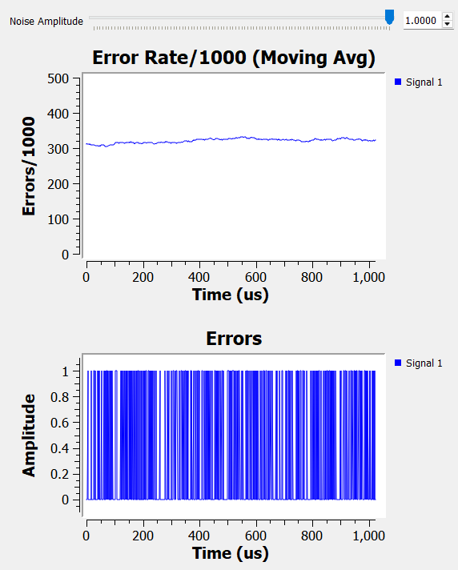

# QAM_Implementation

GNU Radio Companion assignment for ECSE 351, Spring 2025.

## Problem: QAM Implementation with Noise

The problem for the assignment that I chose was:
- Simulate quadrature amplitude modulation using the QAM Mod and QAM Demod blocks in GNU Radio.
- Visualization of the QAM constellation should be included.
- A noise source should then be summed with the modulated signal and the constellation should be viewed again with noise.

The question to consider is:
- For a given raw bitrate, and a given amount of noise, are you better off with more constellation points running slower, or fewer constellation points flagging faster?

## Approach

Figure 1: GNU Radio Flow Graph

To implement QAM in GNU Radio, I first started with an 8-bit [random source](https://wiki.gnuradio.org/index.php/Random_Source) block to generate random data to be able to visualize all different points in the constellation diagram (the choice of 8-bits or a byte a commonly used unit for data in computers and communication systems).

A [throttle](https://wiki.gnuradio.org/index.php/Throttle) block set at the sampling rate is attached to the random source generator to limit the output rate, which then goes through a [packed to unpacked](https://wiki.gnuradio.org/index.php/Packed_to_Unpacked) block set to 4 bits per chunk. QAM is implemented in 16 symbols (constellation points) with 4 bits of data encoding each symbol, so the 8-bit data from the random source generator must be split into two 4-bit chunks before processing.

The directions for this problem called for the use of QAM Mod and QAM Demod blocks. However, I found that these blocks were deprecated, or no longer recommended for use in GNU Radio. Instead, I went with the [constellation encoder](https://wiki.gnuradio.org/index.php?title=Constellation_Encoder) block which encodes the indices of constellation points to plot onto the constellation complex space. The constellation points need to be defined in a [constellation object](https://wiki.gnuradio.org/index.php?title=Constellation_Object), which comes with some preset constellation point mappings for BPSK, QPSK, DQPSK, 8PSK, and 16QAM (which we are interested in).

An example of 16 coordinates on the complex constellation space for QAM would be [(-3-3j), (-1-3j), (1-3j), (3-3j), (-3-1j), (-1-1j), (1-1j), (3-1j), (-3+1j), (-1+1j), (1+1j), (3+1j), (-3+3j), (-1+3j), (1+3j), (3+3j)] with a corresponding symbol map of [0, 4, 12, 8, 1, 5, 13, 9, 3, 7, 15, 11, 2, 6, 14, 10]:

Figure 2: Constellation Diagram, [(Wikipedia, QAM)](https://en.wikipedia.org/wiki/Quadrature_amplitude_modulation)

| Symbol | Constellation Coordinate |
| ------ | ------ |
| 0 | (-3-3j) |
| 1 | (-3-1j) |
| 2 | (-3+3j) |
| 3 | (-3+1j) |
| 4 | (-1-3j) |
| 5 | (-1-1j) |
| ... | ... |
| 15 | (1+1j) |

The encoded output is summed with a Gaussian [noise source](https://wiki.gnuradio.org/index.php?title=Noise_Source) with an adjustable amplitude by the user to add noise to the system.

This output is viewed in a constellation diagram with a constellation sink.

Figure 3: GNU Radio Constellation Diagram

The output is then sent through a [constellation decoder](https://wiki.gnuradio.org/index.php?title=Constellation_Decoder) which uses the same constellation object to regenerate the symbol bitstream, packed using the same 4 bits per chunk with a [unpacked to packed block](https://wiki.gnuradio.org/index.php?title=Unpacked_to_Packed).

The bitstreams before encoding and after encoding, adding noise, and decoding are viewed in 2 separate time sinks.

Figure 4: GNU Radio Original and Reconstructed Bitstreams

Finally, the error rate between these 2 bitstreams is measured every 1000 samples using an XOR block to output differences and put them through a [moving average](https://wiki.gnuradio.org/index.php?title=Moving_Average) block. The error rate is displayed on a time domain with another time sink and quantified in real time with a number sink.

Figure 5: GNU Radio Error Rate and Error Measurements

## QAM Results and Measurements

By increasing the amplitude of the noise source, the user can observe the progressively increasing spread of symbols in the constellation diagram. The threshold after which errors begin appearing after reconstruction appears in Figure 7

Figure 6: Constellation Diagram  No Noise

Figure 7: Constellation Diagram Some Noise (threshold for errors to appear after reconstruction)

Figure 8: Constellation Diagram More Noise

Errors in the original and reconstructed bitstreams are can be visualized in the time domain in Figure 10:

[Bitstream No errors](Images/bitstream_matching.png)
Figure 9: Matching bitstreams

Figure 10: Errors in bitstreams

Increasing error rates are also visualized below:

Figure 11: 0 Error Rate

Figure 12: Low Error Rate

Figure 13: Maximum Error Rate

## BPSK and QPSK Settings

All measurements and plots for BPSK and QPSK can also be made by changing a few variables in the constellation object, packed to unpacked, and unpacked to packed blocks. - For the constellation object, the symbol map and constellation points need to be changed to 4 symbols for QPSK and 2 symbols for BPSK. 
- For the packed to unpacked and unpacked to packed blocks, the bits per chunk (or symbol) need to be changed to 2 for QPSK and 1 for BPSK.
- All three of these settings are already stored in variables and can be used as summarized below:

| Property: | Symbol Map | Constellation Points | Bits per Chunk |
| ------ | ------ | ------ | ------ |
| BPSK: | bpsk_map | bpsk | bpsk_bits |
| QPSK: | qpsk_map | qpsk | qpsk_bits |
| QAM: | QAM16_map | QAM16 | QAM16_bits |

Figure 14: Constellation Object Block Settings

Figure 15: Packed/Unpacked Block Settings

I was attempting to use the GUI chooser so these variables could be adjusted by the user during execution of the flow graph, but the simulation had to be restarted for the changes to be implemented. For now, I have left these disabled in the background of the flow graph. This issue is referenced [here](https://github.com/ptkim621/QAM_Implementation/issues/1).

Figure 16: BPSK Constellation Diagram

Figure 17: QPSK Constellation Diagram

## More Constellation Points or Faster Symbol Rate?

To answer the original question:

> For a given raw bitrate, and a given amount of noise, are you better off with more constellation points running slower, or fewer constellation points flagging faster?
>

QAM can be compared with QPSK and BPSK. While QAM encodes more bits per symbol, it requires a higher signal to noise ratio (SNR) as constellation points are closer together and noise can increase the spread of the point to a point that it is interpreted as an incorrect symbol. On the other hand, lower order modulation schemes can tolerate a lower SNR, yet will require a higher symbol rate to match the data rates of higher order modulation schemes and at the cost of bandwidth.

Figure 18: BPSK Max Error Rate ~ 80/1000

Figure 19: QPSK Max Error Rate ~ 210/1000

Figure 20: QAM Max Error Rate ~ 310/1000

From the error rate comparisions between BPSK, QPSK, and QAM at max noise, I would conclude that fewer constellation points running faster would be the better choice given the lower tolerance for SNR.

## Contributing

Pull requests are welcome.

## License

[MIT License](https://choosealicense.com/licenses/mit/)